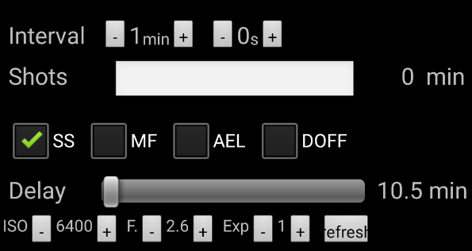

This is a simple modification for me as i don't need BRC3 and burst shooting so i removed them. I added manuall control for ISO, Exp. and Aperture.
It is not bug free and only works if the manual mode is set in the camera ("M")

# TimeLapse

Forked version of [jonasjuffinger](https://github.com/jonasjuffinger)'s TimeLapse App for Sony Cameras. This version adds control of Aperture and Shutter Speed while capturing a TimeLapse. The aperture can be controlled with the C1 and C2 buttons. With the left and right buttons, the shutter speed can be controlled. Alternatively, the upper and lower dial works too but on my Camera, the control was very unresponsive.

A time lapse app for Sony Alpha cameras using the [OpenMemories: Framework](https://github.com/ma1co/OpenMemories-Framework).

I have only a a6300 to test it, if you have another camera I would be happy to receive bug reports.

## Installation ##
Use [Sony-PMCA-RE](https://github.com/ma1co/Sony-PMCA-RE) or install through [sony-pmca.appspot.com](https://sony-pmca.appspot.com/apps).

Thanks to [ma1co](https://github.com/ma1co) for creating this amazing framework and [obs1dium](https://github.com/obs1dium), I used FocusBracket as a code base.

## Usage ##
The app is easy to use. It doesn't have any controls for shutter speed, aperture, ISO, picture quality etc. Adjust all this settings before starting the app, it will use them. If you don't want the camera to focus before each shot, set the camera to manual mode.

Then start the app set the shoot interval and the amount of pictures it should take. Below the seek bars you can see how long it will take to shoot all the photos and how long the video will be. The fps setting only changes the calculation of the video length, the app doesn't produce a video.

Finally click the start button and wait.

You can stop by clicking the MENU button on the camera.

## SS (Silent Shutter) ##
The silent shutter option is functionless on cameras without silent shutter mode.

## MF (Manual Focus) ##
This sets focus mode to manual. Be sure to have focused before starting the app!

## AEL (Auto Exposure Lock) ##
This locks the exposure to the exposure of the first shot.

## BRC3 ##
The app supports exposure bracketing. Set the mode to three-image exposure bracketing outside of the app and check BRC3 checkbox in the app. The app will always take three pictures. Keep in mind that the interval time must be large enough to take all three pictures.

## DOFF (Display Off) ##
Turn the display off between each shot. This doesn't change the battery consumption but it can be healthy for the display when taking very long time lapses.

## Burst mode ##
When selecting the lowest interval the camera is in burst mode. In this mode it takes pictures as fast as it can write to the SD card for the duration set by the second slider.

## Known Issues ##

If the app crashes the camera, please try the following camera settings. They were reported to work with the RX100 M4.
 - The silent shutter needs to be disabled or unchecked in the app, on some cameras
 - If it doesn't work in single shoot mode, please try continuous shooting. It worked for some people.
 - Long exposure noise reduction should be turned off if the interval is less than double the shutter speed.
